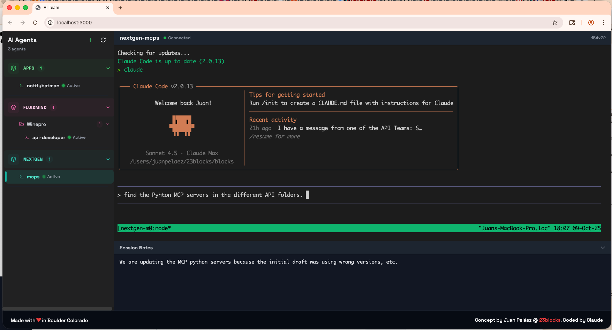
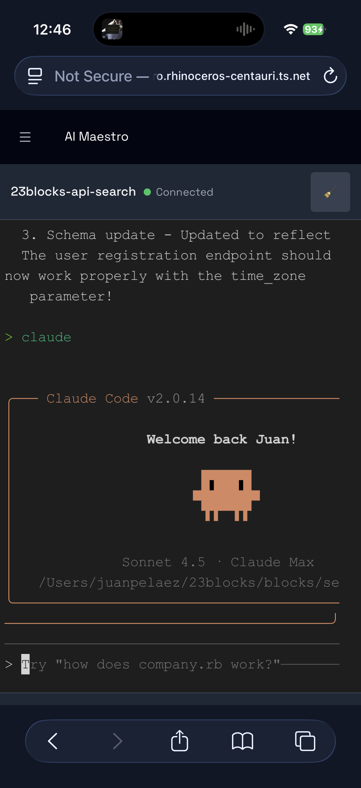
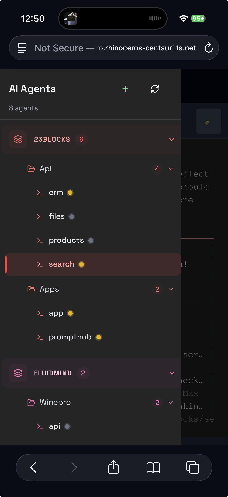
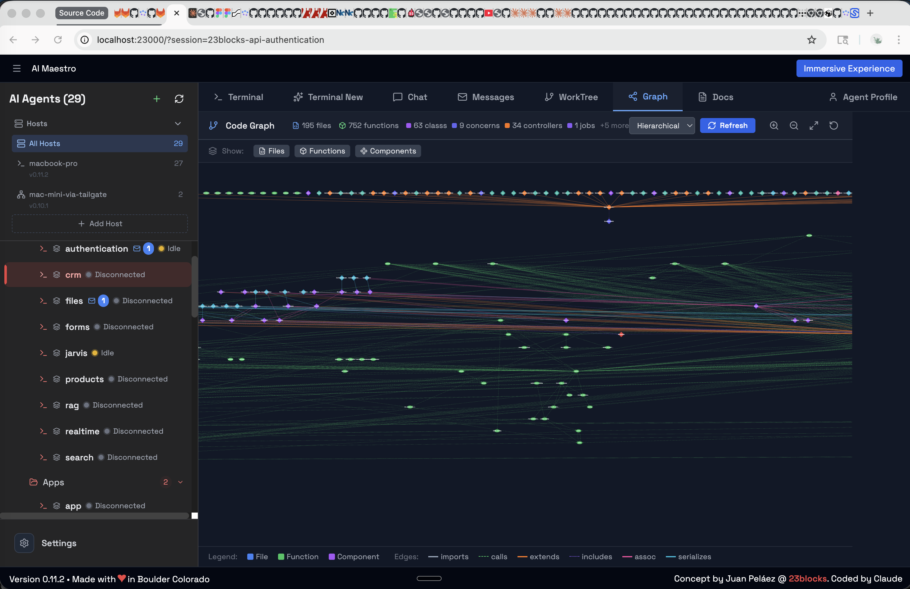

<div align="center">


# AI Maestro

*I was running 35 AI agents across multiple terminals and became the human mailman between them. So I built AI Maestro.*

**The OS for AI-first organizations — orchestrate any AI agent with persistent memory, agent-to-agent messaging, and multi-machine support.**

[](https://github.com/23blocks-OS/ai-maestro/releases)
[-lightgrey)](https://github.com/23blocks-OS/ai-maestro)
[](./LICENSE)
[](https://github.com/23blocks-OS/ai-maestro)



[Quick Start](#-quick-start) · [Features](#-features) · [Documentation](#-documentation) · [Contributing](./CONTRIBUTING.md)

</div>

---

## The Story

I gave an AI agent a real task — not autocomplete, a real engineering problem. It checked the code, read the logs, queried the database, and came back with the answer. That was the moment. *This thing can actually work.*

Within a week I was running 35 agents across terminals. They were productive, but they couldn't talk to each other. I became the human message bus — copying context from one terminal, pasting into another. I was the bottleneck in my own AI team.

**So I built AI Maestro** — one dashboard to see every agent, on every machine, with persistent memory and direct agent-to-agent communication. Today I run 80+ agents across multiple computers, building real companies with them every day.

**What makes this different:**
- **Works with any AI agent** — Claude Code, Codex, Aider, Cursor, OpenClaw, Hermes, Droid, or any terminal-based agent. We don't lock you in.
- **Multi-machine from day one** — Peer mesh network with no central server. Nobody else does this.
- **Agents that communicate** — The Agent Messaging Protocol (AMP) lets agents coordinate directly. You orchestrate, they collaborate.

---

## Quick Start

```bash
curl -fsSL https://raw.githubusercontent.com/23blocks-OS/ai-maestro/main/scripts/remote-install.sh | sh
```

This installs everything you need:
- AI Maestro dashboard and service
- Agent messaging system (AMP)
- Claude Code plugin with 5 skills and 32 CLI scripts

**Time:** 5-10 minutes · **Requires:** Node.js 18+, tmux

<details>
<summary>Windows (WSL2) / Linux notes</summary>

**Windows:** Install WSL2 first, then run the curl command inside Ubuntu:

```powershell
wsl --install
```

[Full Windows guide](./docs/WINDOWS-INSTALLATION.md)

**Linux:** Ensure build tools are installed: `sudo apt install tmux build-essential`
</details>

<details>
<summary>Manual install</summary>

```bash
git clone https://github.com/23blocks-OS/ai-maestro.git
cd ai-maestro
yarn install
yarn dev
```

See [QUICKSTART.md](./docs/QUICKSTART.md) for detailed setup options.
</details>

Dashboard opens at `http://localhost:23000`

---

## Features

Every feature was born from running a real AI-first organization. We built them in the order we needed them.

### One Dashboard

*I had 35 terminals and couldn't tell which was which.*

See and manage all your AI agents in one place. Create agents from the UI with a guided wizard, organize them with smart naming (`project-backend-api` becomes a 3-level tree with auto-coloring), and switch between any agent with a click. Four deployment modes: **tmux** (local), **Docker** (containerized), **AWS EC2** (dedicated instance), and **AWS ECS Fargate** (serverless). Auto-discovers tmux sessions, Docker containers, cloud deployments, and standalone agents.

### Any Machine

*My Mac Mini was sitting there idle. What if I ran agents on that too?*

A peer mesh network where every machine is equal. Add a computer, it joins the mesh. Every agent on every machine, visible from one dashboard. Use each machine for what it's best at — Mac for iOS builds, Linux for Docker, cloud for heavy compute. **No central server required.**

### Agent Messaging

*I was the mailman — copying messages between agents because they couldn't talk to each other.*

The [Agent Messaging Protocol (AMP)](https://agentmessaging.org) gives your agents email-like communication. Priority levels, message types, cryptographic signatures, and push notifications. Tell your agent *"send a message to backend about the deployment"* — it just works. Agents coordinate directly while you manage the big picture.

**Before AMP:** You copy research from one terminal, paste into another, repeat 50 times a day.
**With AMP:** *"Research agent, send your findings to the writing agent."* Done.

### Gateways

*A friend in Singapore wanted his agents to talk to mine. But I didn't want to give him access to my network.*

Connect your AI agents to [Slack](https://github.com/23blocks-OS/aimaestro-gateways), Discord, Email, and WhatsApp through organizational gateways. Smart routing (`@AIM:agent-name`), thread-aware responses, and content security with 34 prompt injection patterns detected at the gateway — before any agent sees the message.

### Persistent Memory

*Every morning, my agents woke up with amnesia.*

Three layers of intelligence that grow over time: **Memory** (agents remember past conversations and decisions), **Code Graph** (interactive visualization of your entire codebase with delta indexing), and **Documentation** (auto-generated, searchable docs from your code). Agents get smarter the longer they work with you.

### Work Coordination

*Talking isn't working. I needed agents to coordinate on actual deliverables.*

Assemble agents into teams, run meetings in split-pane war rooms, and track tasks on a full Kanban board with drag-and-drop, dependencies, and 5 status columns. Cross-machine teams work seamlessly. This is project management for your AI workforce.

### Agent Identity

*At 80 agents, they all looked the same.*

Custom avatars, personality profiles, and visual presence for every agent. When an agent has a face and a role, you instinctively assign it the right work — just like a real team.

### Agent Deployment

*One agent on my laptop. Another on EC2. A third on Fargate. All in the same dashboard.*

Four ways to run agents, each for a different need:

| Mode | What | Best For |
|------|------|----------|
| **tmux** | Direct terminal sessions on your machine | Local development, zero setup |
| **Docker** | Containerized agents with resource limits | Isolation, reproducibility, multi-project |
| **AWS EC2** | Dedicated Graviton instance with native install, Nginx + SSL | Always-on agents, SSH access, persistent workloads |
| **AWS ECS Fargate** | Serverless containers, auto-built Docker image | Burst scaling, zero maintenance, pay-per-use |

Cloud agents are Terraform-managed. EC2 installs Node.js, tmux, and AI CLIs directly on ARM64 hardware (no Docker overhead). ECS auto-builds your Docker image, pushes to ECR, and runs on Fargate. Both deploy with one command from the dashboard or CLI.

```bash
# EC2: dedicated instance with SSL
aimaestro-agent.sh create my-api --ec2 \
  --domain api.example.com --ssl-email admin@example.com --key-name my-key

# ECS Fargate: serverless (auto-builds image)
aimaestro-agent.sh create worker --ecs
```

---

## Meet Lola — Your First Hire

Every AI-first organization starts with one agent. **Lola** is yours — a batteries-included Chief of Staff framework built for AI Maestro. She handles email triage, semantic memory, task management, and content security out of the box. Install the platform, deploy Lola, and you have your first employee on day one.

```bash
# Clone and deploy Lola on AI Maestro
git clone https://github.com/23blocks-OS/lolabot.git
cd lolabot && ./setup.sh
```

**The LolaBot Ecosystem:**
- **[LolaBot Framework](https://github.com/23blocks-OS/lolabot)** — Open-source agent framework. Build your own Lola.
- **[lolabots.com](https://lolabots.com)** — The LolaBot Factory. Pre-built agent templates, one-click deploy.

[Learn more about Lola →](https://github.com/23blocks-OS/lolabot)

---

## The Agent Ecosystem

Every agent is built from five dimensions:

| | Dimension | What | Where |
|-|-----------|------|-------|
| **WHO** | Personality | Domain expertise, workflows, deliverables | [Agent Library](https://github.com/msitarzewski/agency-agents) (150+) |
| **HOW** | Capabilities | Skills, scripts, CLI tools, Canvas | [Plugin Builder](https://github.com/23blocks-OS/ai-maestro-plugins) |
| **TRUST** | Identity | Cryptographic keys, OAuth tokens | [AID](https://agentids.org) |
| **TALK** | Communication | Agent-to-agent messaging | [AMP](https://agentmessaging.org) |
| **ACT** | Actions | Tool execution, API calls, workflows | [AAP](https://agentactions.org) |

**Open Protocols** — AI Maestro is built on three open standards:
- **[AMP](https://agentmessaging.org)** — Agent Messaging Protocol. Email-like communication between agents with cryptographic signatures.
- **[AID](https://agentids.org)** — Agent Identity. Portable cryptographic identity for agents across platforms.
- **[AAP](https://agentactions.org)** — Agent Actions Protocol. Standardized tool execution and workflow triggers.

AI Maestro is the stage. Pick personalities, give them skills, and run them from one dashboard.

[Read the full ecosystem guide →](./docs/ECOSYSTEM.md)

---

## Who Is This For

**Founders building AI-first organizations.** You're the CEO, your agents are the team. Solo operators, agency owners, and anyone running a business where AI agents do the work and you drive the strategy. Start with Lola, add specialists, scale your AI workforce.

**Developers running multiple AI agents.** If you have 3+ agents and you're switching between terminals, losing context, and playing messenger — this is for you. Works with Claude Code, Codex, Aider, Cursor, or any terminal-based AI.

**Teams coordinating AI-assisted work.** Multiple developers, multiple agents, multiple machines. One dashboard. Agent-to-agent messaging replaces you as the bottleneck.

**Creators and operators** who want to connect AI agents to the outside world through Slack, Discord, or Email — without exposing their infrastructure.

---

<details>
<summary><b>Screenshots</b></summary>

<div align="center">


</div>

**Code Graph** — Interactive codebase visualization



**Agent Inbox** — Direct agent-to-agent messaging


</details>

---

## Documentation

**New here?**
- [Quick Start Guide](./docs/QUICKSTART.md) — Get up and running
- [Core Concepts](./docs/CONCEPTS.md) — Understand how it works
- [Use Cases](./docs/USE-CASES.md) — Real examples of what people build

**Going deeper:**
- [Multi-Machine Setup](./docs/SETUP-TUTORIAL.md) · [Network Access](./docs/NETWORK-ACCESS.md)
- [Cloud Deployment (AWS)](./docs/cloud-aws.html) · [Docker Agents](./docs/docker-local.html)
- [Agent Messaging Guide](./docs/AGENT-MESSAGING-GUIDE.md) · [Architecture](./docs/AGENT-COMMUNICATION-ARCHITECTURE.md)
- [Intelligence Guide](./docs/AGENT-INTELLIGENCE.md) · [Code Graph](./docs/images/code_graph01.png)
- [Operations Guide](./docs/OPERATIONS-GUIDE.md)

**Troubleshooting:**
- [Common Issues](./docs/TROUBLESHOOTING.md) · [Security](./SECURITY.md) · [Windows Installation](./docs/WINDOWS-INSTALLATION.md)

**Open Protocols:**
- [AMP](https://agentmessaging.org) · [AID](https://agentids.org) · [AAP](https://agentactions.org)

**Extending:**
- [Plugin Development](./plugin/README.md) · [API Reference](./docs/AGENT-COMMUNICATION-ARCHITECTURE.md) · [Ecosystem Guide](./docs/ECOSYSTEM.md)

---

## What's Next

- Agent search and filtering across the entire mesh
- Agent playback — time-travel through agent sessions
- Performance analytics dashboard

See the full [roadmap](https://github.com/23blocks-OS/ai-maestro/issues) and [join the discussion](https://github.com/23blocks-OS/ai-maestro/discussions).

---

## Contributing

We love contributions. See [CONTRIBUTING.md](./CONTRIBUTING.md) for guidelines.

- [Report a bug](https://github.com/23blocks-OS/ai-maestro/issues)
- [Request a feature](https://github.com/23blocks-OS/ai-maestro/issues/new?labels=enhancement)

<details>
<summary><b>Acknowledgments</b></summary>

Built with [Next.js](https://nextjs.org/), [xterm.js](https://xtermjs.org/), [CozoDB](https://www.cozodb.org/), [ts-morph](https://ts-morph.com/), [tmux](https://github.com/tmux/tmux), and [Claude Code](https://claude.ai).

</details>

---

## License

MIT — see [LICENSE](./LICENSE). Free for any purpose, including commercial.

---

<div align="center">

**Made with love in Boulder (USA), Roma (Italy), and many other cool places**

[Juan Pelaez](https://x.com/jkpelaez) · [23blocks](https://23blocks.com)

*Built by AI Agents with Humans in the driver seat — for AI-first organizations, AI-enabled humans, and autonomous agents*

[Star us on GitHub](https://github.com/23blocks-OS/ai-maestro)

</div>

## FAQ

**Do I need to use Claude Code?**
No. AI Maestro works with any terminal-based AI agent — Claude Code, Codex, Aider, Cursor, OpenClaw, Hermes, Droid, or your own scripts. We're agent-agnostic.

**Does it work on Linux / Windows?**
Yes. macOS and Linux natively. Windows via WSL2 — see the [Windows guide](./docs/WINDOWS-INSTALLATION.md).

**Can agents on different machines talk to each other?**
Yes. The [Agent Messaging Protocol (AMP)](https://agentmessaging.org) handles cross-machine messaging with cryptographic signatures and push notifications. No central server required.

**What are AID and AAP?**
[AID](https://agentids.org) (Agent Identity) gives each agent a portable cryptographic identity. [AAP](https://agentactions.org) (Agent Actions Protocol) standardizes how agents execute tools and trigger workflows. Together with [AMP](https://agentmessaging.org), they form the open protocol stack that AI Maestro is built on.

**What is the Canvas skill?**
Canvas lets agents generate visual artifacts — diagrams, charts, and interactive documents — directly from conversations. It's part of the plugin system and available to any agent.

**How is this different from just using tmux?**
tmux gives you terminals. AI Maestro gives you an organization — persistent memory, agent-to-agent messaging, team coordination, Kanban boards, multi-machine mesh, cloud deployment, and gateway integrations. tmux is the foundation; AI Maestro is the building.

**What is LolaBot?**
[LolaBot](https://github.com/23blocks-OS/lolabot) is an open-source agent framework — a batteries-included Chief of Staff that handles email, memory, tasks, and security. The [LolaBot Factory](https://lolabots.com) offers pre-built agent templates for one-click deployment.

**Is there a hosted / cloud version?**
Not yet. AI Maestro runs on your machines. You own your data, your agents, and your infrastructure.

**How do I add more agents?**
Create them from the dashboard UI, the CLI (`aimaestro-agent.sh create`), or just start a new tmux session — AI Maestro auto-discovers it.
